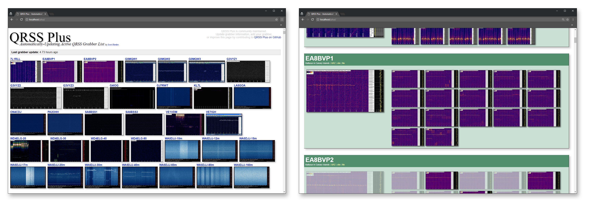

# QRSS Plus

**QRSS Plus is an automatically-updating QRSS grabber website designed to fully operate on a web server.** The core of this project is a configuration file (containing the names and URLs of all grabbers), a python file (which downloads all the latest grabs), and a PHP script (which displays the recent grabs via a web interface). As long as the python script runs every 10 minutes, the website will always display the latest grabs from all grabbers, categorizing each as active or inactive respectively.

**QRSS Plus running on the author's website:**\
http://www.swharden.com/qrss/plus/

Although the author has run QRSS Plus on his website for several years and intends to continue doing so, **anybody can set-up their own QRSS Plus webpage!** Just copy this folder to your web server and call [QRSSplusUpdate.py](QRSSplusUpdate.py) every 10 minutes. Those who decide to independently set-up their own QRSS Plus page are encouraged to improve the code, add new features to the web interface, or incorporating new functionality, as these improvements enhance the QRSS community at large. 

## Technical Details

**Requirements:** This project is intended to be light, as it is run on headless web servers and at best manually controlled through a SSH console. It was developed to require Python 2.7 (Python 3 is often not available on inexpensive web hosting plans), and any modern version of PHP will suffice. ImageMagick's [convert utility](https://www.imagemagick.org/script/convert.php) is assumed to be present (used for making thumbnails).

**Configuration file:** Grabber information (image URL, website, operator call sign, etc) is stored in [grabbers.csv](grabbers.csv). This format was chosen because it is simple to edit on any computer, including through GitHub's web interface.

**Folder structure:** A download folder contains all downloaded files. Every file has a timestamp in epoch format and also an image hash code. New images are detected as new because its MD5 hash will be different. Every time [QRSSplusUpdate.py](QRSSplusUpdate.py) is run, all files with timestamps older than a certain amount (typically 3 hours) are deleted, and new grabber files are downloaded. If a grabber download fails, an empty file with a ".fail" extension is added to the download folder.

**Web interface:** The web interface is provided by [index.php](index.php) which simply displays all the grabbers listed in the configuration file next to all the relevant images found in the downloads folder. If no images are found in the downloads folder for a certain grabber, that grabber is marked as inactive.

**Detecting problems:** What if QRSS Plus stops downloading new grabs? Every time QRSS Plus is updated, the total duration the script took to download all grabs is saved in a text file (containing only the number of seconds as a floating point number). The PHP script can display how long the last download took by reading the content of this file, and it can determine if QRSS Plus stopped running by looking at the modification time of the file. If an issue is detected, PHP will raise an alarm message at the top of the page indicating the author should be contacted to resolve the issue.

## Contribute to this Project
Anyone with an interest in supporting the QRSS community is encouraged to contribute to this project! Maintenance of the [grabber list](grabbers.csv) is especially useful as new grabbers come online. Don't hesitate to make a pull request, or better yet become a project collaborator!

## Additional Resources
* [Knights QRSS Mailing List](https://groups.io/g/qrssknights) - The QRSS Knights is an extremely active community of QRSS enthusiasts. Join their mailing list to get in on discussions about new grabbers, radio spots, equipment, reception techniques, cosmic and atmospheric anomalies, and efforts in the QRSS world.
* [Knights QRSS Blog](http://knightsqrss.blogspot.com/) - Updated less frequently, but worth noting
* [Getting Started with QRSS](http://knightsqrss.blogspot.com/2010/01/getting-started-with-qrss.html) - A good guide for those new to QRSS
* [Carpe QRSS](https://github.com/strickyak/carpe-qrss) - A QRSS grabber built on the GO language
* [LOPORA](http://www.qsl.net/pa2ohh/11lop.htm) - QRSS reception program in python
* [QRP-Labs](https://www.qrp-labs.com/) - QRSS transmitter kits by [Hans Summers](http://www.hanssummers.com)
